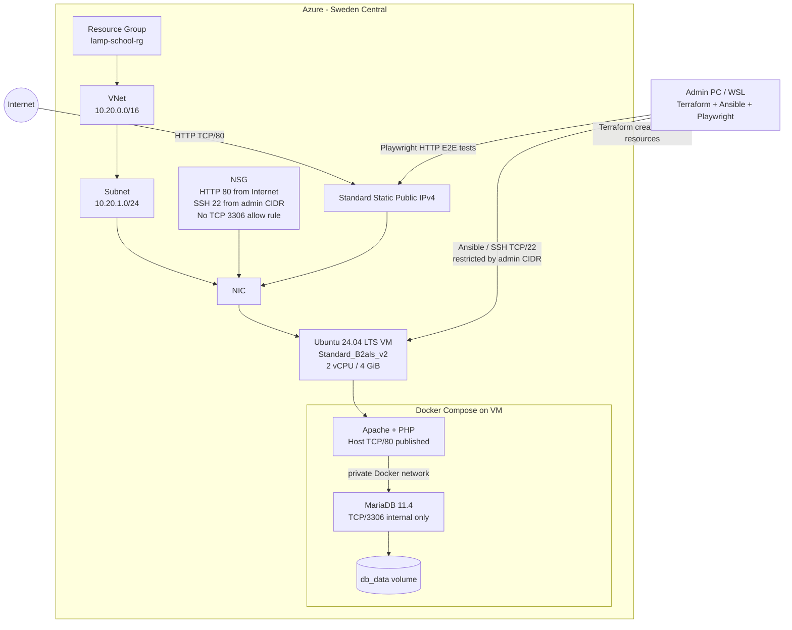

# Architecture diagram



## Provisioning flow

```text
Terraform
   |
   +--> Resource Group
   +--> VNet + Subnet
   +--> NSG
   +--> Static Public IP
   +--> NIC
   +--> Ubuntu VM
             |
             v
          Ansible
             |
             +--> install/start Docker
             +--> copy application files
             +--> create protected .env
             +--> docker compose up -d --build
                         |
                         +--> Apache/PHP
                         +--> MariaDB + db_data
```

## Runtime/security flow

1. The internet reaches the VM through the Standard public IPv4 address.
2. The NSG allows HTTP on TCP/80 from the internet.
3. The NSG allows SSH on TCP/22 only from the configured administrator `/32` CIDR.
4. Apache/PHP is the only Docker service with a published host port.
5. MariaDB TCP/3306 has no Azure NSG allow rule and no Docker host-port mapping.
6. PHP reaches MariaDB using the private Docker bridge network and the Compose service name `db`.
7. MariaDB data is stored in the named `db_data` Docker volume.
8. Playwright tests the public-IP deployment from the administrator's machine.
